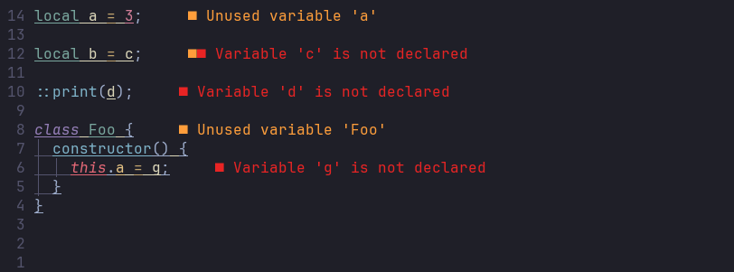

# Squirrel LSP

Implementation of a [LSP](https://microsoft.github.io/language-server-protocol/overviews/lsp/overview/) for the [Squirrel](http://www.squirrel-lang.org/) scripting language.

I use Squirrel in some personal projects and hate when it fails on me only because I mistyped a variable name or did a syntax error, so I made this little incomplete LSP to help me with that. It leaves a lot to be desired, so I'll be updating it as I go.

## Functionality

- [x] File parsing and diagnostics reporting
- [ ] Static analysis to check if used variables/class members/functions exist (Partialy implemented. Member access by dot notation is currently not supported)
- [ ] Some sort of configuration to define embedded functions and methods
- [ ] Hover Functionality
- [x] Go to definition Functionality
- [ ] Rename functionality
- [ ] File formatting
